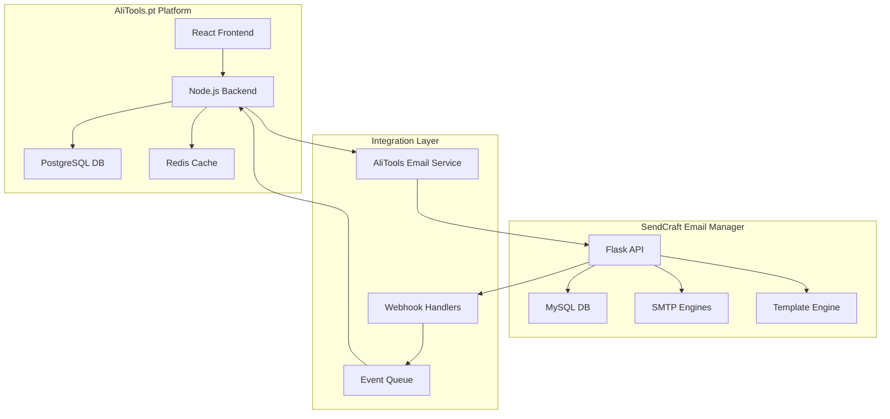

# 🔗 SendCraft ↔ AliTools.pt - Plano Integração Completo

## 🎯 **VISÃO GERAL INTEGRAÇÃO**

### **Objetivo Estratégico**
Transformar o **AliTools.pt** numa plataforma B2B completamente automatizada através da integração com **SendCraft Email Manager**, eliminando dependências manuais de email e criando workflows inteligentes de comunicação.

### **Benefícios Business**
- **📧 Automação 100%** de todos os emails transacionais
- **📊 Tracking completo** de comunicações clientes/fornecedores  
- **🎨 Branding consistente** através de templates centralizados
- **⚡ Performance** superior com SMTP otimizado
- **📈 Analytics** detalhadas para optimização conversões
- **🔄 Escalabilidade** para crescimento exponencial

---

## 🏗️ **ARQUITETURA INTEGRAÇÃO**

### **Topology Overview**


### **Communication Flow**
1. **AliTools** evento trigger (nova encomenda, registo user, etc.)
2. **AliTools Email Service** processa evento e formata dados
3. **SendCraft API** recebe request e processa template
4. **SMTP Engine** envia email via conta configurada
5. **Webhook** notifica AliTools sobre status entrega
6. **AliTools** atualiza UI/DB com status final

---

## 📨 **EMAIL WORKFLOWS ALITOOLS**

### **1. CUSTOMER JOURNEY EMAILS**

#### **1.1. Registo de Cliente**
```javascript
// AliTools: Após registo cliente
const welcomeEmail = {
  trigger: 'customer.registered',
  sendcraft_config: {
    template_id: 'alitools_welcome_customer',
    from_account: 'welcome@alitools.pt',
    to_address: customer.email,
    variables: {
      customer_name: customer.name,
      company_name: customer.company || customer.name,
      login_url: 'https://alitools.pt/login',
      catalog_url: 'https://alitools.pt/catalog',
      support_email: 'suporte@alitools.pt',
      account_manager: customer.account_manager?.name || 'Equipa AliTools'
    }
  }
};
```

#### **1.2. Confirmação de Encomenda**
```javascript
// AliTools: Após checkout completo
const orderConfirmation = {
  trigger: 'order.confirmed',
  sendcraft_config: {
    template_id: 'alitools_order_confirmation',
    from_account: 'encomendas@alitools.pt',
    to_address: order.customer.email,
    variables: {
      order_number: order.reference,
      customer_name: order.customer.name,
      order_date: order.created_at,
      order_total: `€${order.total.toFixed(2)}`,
      items: order.items.map(item => ({
        name: item.product.name,
        sku: item.product.sku,
        quantity: item.quantity,
        price: `€${item.price.toFixed(2)}`,
        image_url: item.product.main_image_url
      })),
      shipping_address: formatAddress(order.shipping_address),
      tracking_url: `https://alitools.pt/tracking/${order.tracking_code}`,
      invoice_url: `https://alitools.pt/invoices/${order.id}/pdf`,
      estimated_delivery: order.estimated_delivery_date
    }
  }
};
```

#### **1.3. Updates Status Encomenda**
```javascript
// AliTools: Updates automáticos status
const statusUpdates = {
  'order.processing': {
    template_id: 'alitools_order_processing',
    subject: 'Encomenda #{{order_number}} - Em Processamento'
  },
  'order.shipped': {
    template_id: 'alitools_order_shipped', 
    subject: 'Encomenda #{{order_number}} - Enviada'
  },
  'order.delivered': {
    template_id: 'alitools_order_delivered',
    subject: 'Encomenda #{{order_number}} - Entregue'
  },
  'order.delayed': {
    template_id: 'alitools_order_delayed',
    subject: 'Encomenda #{{order_number}} - Atraso na Entrega'
  }
};
```

### **2. SUPPLIER COMMUNICATION WORKFLOW**

#### **2.1. Notificação Nova Encomenda**
```javascript
// AliTools: Automação para fornecedores
const supplierNotification = {
  trigger: 'order.confirmed',
  sendcraft_config: {
    template_id: 'alitools_supplier_new_order',
    from_account: 'fornecedores@alitools.pt',
    to_address: supplier.email,
    cc_addresses: [supplier.account_manager_email, 'procurement@alitools.pt'],
    variables: {
      supplier_name: supplier.company_name,
      order_id: order.id,
      order_reference: order.reference,
      customer_company: order.customer.company,
      urgency_level: order.urgency || 'normal',
      items: order.items.filter(item => item.supplier_id === supplier.id),
      total_amount: calculateSupplierTotal(order, supplier.id),
      deadline_date: order.supplier_deadline_date,
      shipping_address: formatAddress(order.shipping_address),
      special_instructions: order.supplier_notes,
      portal_url: `https://suppliers.alitools.pt/orders/${order.id}`,
      contact_phone: '+351 123 456 789'
    }
  }
};
```

#### **2.2. Follow-up Fornecedores**
```javascript
// AliTools: Sistema follow-up automático
const supplierFollowup = {
  trigger: 'order.supplier_no_response_24h',
  sendcraft_config: {
    template_id: 'alitools_supplier_followup',
    from_account: 'urgente@alitools.pt',
    to_address: supplier.email,
    priority: 'high',
    variables: {
      supplier_name: supplier.company_name,
      order_reference: order.reference,
      hours_since_order: calculateHoursSince(order.created_at),
      escalation_contact: 'procurement@alitools.pt',
      direct_phone: '+351 123 456 789'
    }
  }
};
```

### **3. MARKETING AUTOMATION**

#### **3.1. Newsletter Personalizada**
```javascript
// AliTools: Newsletter baseada em comportamento
const personalizedNewsletter = {
  trigger: 'cron.weekly_newsletter',
  sendcraft_config: {
    template_id: 'alitools_newsletter_personalized',
    from_account: 'marketing@alitools.pt',
    variables: {
      customer_name: customer.name,
      last_order_date: customer.last_order_date,
      recommended_products: getRecommendations(customer.id),
      trending_categories: getTrendingCategories(),
      special_offers: getPersonalizedOffers(customer.id),
      unsubscribe_url: `https://alitools.pt/unsubscribe/${customer.unsubscribe_token}`
    }
  }
};
```

#### **3.2. Carrinho Abandonado**
```javascript
// AliTools: Recovery emails carrinho abandonado
const abandonedCartSequence = [
  {
    delay: '1 hour',
    template_id: 'alitools_cart_abandoned_1h',
    subject: 'Esqueceu-se de algo? 🛒'
  },
  {
    delay: '24 hours', 
    template_id: 'alitools_cart_abandoned_24h',
    subject: 'Última oportunidade - 10% desconto'
  },
  {
    delay: '72 hours',
    template_id: 'alitools_cart_abandoned_final',
    subject: 'Produtos ainda disponíveis por pouco tempo'
  }
];
```

---

## 🔧 **IMPLEMENTAÇÃO TÉCNICA**

### **1. AliTools Email Service Layer**

#### **Estrutura do Serviço:**
```javascript
// services/EmailService.js
class EmailService {
  constructor() {
    this.sendcraftAPI = new SendCraftAPIClient({
      baseURL: process.env.SENDCRAFT_API_URL,
      apiKey: process.env.SENDCRAFT_API_KEY
    });
  }

  // Método genérico envio email
  async sendEmail(emailData) {
    try {
      const response = await this.sendcraftAPI.post('/emails/send', {
        from_account_id: emailData.from_account_id,
        to_address: emailData.to_address,
        cc_addresses: emailData.cc_addresses,
        template_id: emailData.template_id,
        variables: emailData.variables,
        tracking_enabled: true,
        schedule_at: emailData.schedule_at
      });

      // Store tracking info no AliTools DB
      await this.saveEmailTracking({
        sendcraft_email_id: response.data.email_id,
        alitools_entity_type: emailData.entity_type,
        alitools_entity_id: emailData.entity_id,
        template_id: emailData.template_id,
        status: 'sent'
      });

      return response.data;
    } catch (error) {
      console.error('SendCraft email failed:', error);
      throw new EmailSendingError(error.message);
    }
  }

  // Método específico confirmação encomenda  
  async sendOrderConfirmation(order) {
    return this.sendEmail({
      from_account_id: 1, // encomendas@alitools.pt
      to_address: order.customer.email,
      template_id: 'alitools_order_confirmation',
      entity_type: 'order',
      entity_id: order.id,
      variables: this.formatOrderVariables(order)
    });
  }

  // Método específico notificação fornecedor
  async sendSupplierNotification(supplier, order) {
    return this.sendEmail({
      from_account_id: 2, // fornecedores@alitools.pt
      to_address: supplier.email,
      cc_addresses: ['procurement@alitools.pt'],
      template_id: 'alitools_supplier_new_order',
      entity_type: 'supplier_order',
      entity_id: `${supplier.id}_${order.id}`,
      variables: this.formatSupplierVariables(supplier, order)
    });
  }

  // Formatação variáveis específicas AliTools
  formatOrderVariables(order) {
    return {
      order_number: order.reference,
      customer_name: order.customer.name,
      customer_company: order.customer.company,
      order_date: this.formatDate(order.created_at),
      order_total: this.formatCurrency(order.total),
      items: order.items.map(item => ({
        name: item.product.name,
        sku: item.product.sku,
        quantity: item.quantity,
        unit_price: this.formatCurrency(item.unit_price),
        total_price: this.formatCurrency(item.total_price),
        image_url: this.getProductImageURL(item.product)
      })),
      shipping_address: this.formatShippingAddress(order.shipping_address),
      billing_address: this.formatBillingAddress(order.billing_address),
      payment_method: order.payment_method,
      tracking_url: `${process.env.ALITOOLS_FRONTEND_URL}/tracking/${order.tracking_code}`,
      invoice_url: `${process.env.ALITOOLS_FRONTEND_URL}/invoices/${order.id}/pdf`,
      support_url: `${process.env.ALITOOLS_FRONTEND_URL}/support`,
      estimated_delivery: this.formatDate(order.estimated_delivery_date)
    };
  }
}
```

### **2. SendCraft API Client**

#### **Cliente JavaScript Customizado:**
```javascript
// lib/SendCraftAPIClient.js
class SendCraftAPIClient {
  constructor(config) {
    this.baseURL = config.baseURL;
    this.apiKey = config.apiKey;
    this.timeout = config.timeout || 30000;
  }

  async post(endpoint, data) {
    const response = await fetch(`${this.baseURL}${endpoint}`, {
      method: 'POST',
      headers: {
        'Content-Type': 'application/json',
        'X-API-Key': this.apiKey,
        'User-Agent': 'AliTools-Integration/1.0'
      },
      body: JSON.stringify(data),
      timeout: this.timeout
    });

    if (!response.ok) {
      const error = await response.json();
      throw new SendCraftAPIError(error.message, response.status);
    }

    return response.json();
  }

  async get(endpoint, params = {}) {
    const url = new URL(`${this.baseURL}${endpoint}`);
    Object.keys(params).forEach(key => url.searchParams.append(key, params[key]));

    const response = await fetch(url, {
      headers: {
        'X-API-Key': this.apiKey,
        'User-Agent': 'AliTools-Integration/1.0'
      },
      timeout: this.timeout
    });

    if (!response.ok) {
      const error = await response.json();
      throw new SendCraftAPIError(error.message, response.status);
    }

    return response.json();
  }

  // Métodos específicos SendCraft
  async sendEmail(emailData) {
    return this.post('/api/v1/emails/send', emailData);
  }

  async getEmailStatus(emailId) {
    return this.get(`/api/v1/emails/${emailId}/status`);
  }

  async getEmailAnalytics(emailId) {
    return this.get(`/api/v1/emails/${emailId}/analytics`);
  }

  async listTemplates() {
    return this.get('/api/v1/templates');
  }

  async previewTemplate(templateId, variables) {
    return this.post(`/api/v1/templates/${templateId}/preview`, { variables });
  }
}
```

### **3. Webhook Handler System**

#### **Webhook Receiver AliTools:**
```javascript
// routes/webhooks/sendcraft.js
const express = require('express');
const crypto = require('crypto');
const router = express.Router();

// Middleware validação webhook signature
const validateWebhookSignature = (req, res, next) => {
  const signature = req.headers['x-sendcraft-signature'];
  const payload = JSON.stringify(req.body);
  const expectedSignature = crypto
    .createHmac('sha256', process.env.SENDCRAFT_WEBHOOK_SECRET)
    .update(payload)
    .digest('hex');

  if (signature !== `sha256=${expectedSignature}`) {
    return res.status(401).json({ error: 'Invalid signature' });
  }
  next();
};

// Handler eventos SendCraft
router.post('/sendcraft/events', validateWebhookSignature, async (req, res) => {
  const { event_type, data } = req.body;

  try {
    switch (event_type) {
      case 'email.sent':
        await handleEmailSent(data);
        break;
      case 'email.delivered':
        await handleEmailDelivered(data);
        break;
      case 'email.opened':
        await handleEmailOpened(data);
        break;
      case 'email.clicked':
        await handleEmailClicked(data);
        break;
      case 'email.failed':
        await handleEmailFailed(data);
        break;
      case 'email.bounced':
        await handleEmailBounced(data);
        break;
      default:
        console.log(`Unknown event type: ${event_type}`);
    }

    res.json({ status: 'processed' });
  } catch (error) {
    console.error('Webhook processing failed:', error);
    res.status(500).json({ error: 'Processing failed' });
  }
});

// Handlers específicos eventos
async function handleEmailSent(data) {
  await EmailTracking.update(
    { status: 'sent', sent_at: new Date(data.sent_at) },
    { where: { sendcraft_email_id: data.email_id } }
  );
  
  // Atualizar status na ordem se aplicável
  if (data.metadata?.order_id) {
    await Order.update(
      { email_notification_status: 'sent' },
      { where: { id: data.metadata.order_id } }
    );
  }
}

async function handleEmailDelivered(data) {
  await EmailTracking.update(
    { status: 'delivered', delivered_at: new Date(data.delivered_at) },
    { where: { sendcraft_email_id: data.email_id } }
  );

  // Trigger follow-up emails se necessário
  const tracking = await EmailTracking.findOne({
    where: { sendcraft_email_id: data.email_id }
  });

  if (tracking.template_id === 'alitools_order_confirmation') {
    // Agendar email satisfação cliente em 7 dias
    await scheduleFollowupEmail(tracking.alitools_entity_id, 'satisfaction_survey', 7);
  }
}

async function handleEmailOpened(data) {
  await EmailTracking.increment('opens_count', {
    where: { sendcraft_email_id: data.email_id }
  });

  // Analytics e scoring cliente
  await updateCustomerEngagementScore(data.recipient_email, 'email_opened');
}
```

### **4. Event-Driven Architecture**

#### **Event Emitters AliTools:**
```javascript
// events/OrderEvents.js
const EventEmitter = require('events');

class OrderEventEmitter extends EventEmitter {
  constructor() {
    super();
    this.setupListeners();
  }

  setupListeners() {
    // Confirmação encomenda
    this.on('order.confirmed', async (order) => {
      await Promise.all([
        EmailService.sendOrderConfirmation(order),
        this.notifySuppliers(order),
        this.updateCustomerJourney(order.customer_id, 'order_confirmed')
      ]);
    });

    // Mudança status encomenda
    this.on('order.status_changed', async (order, oldStatus, newStatus) => {
      const emailTemplate = this.getStatusEmailTemplate(newStatus);
      if (emailTemplate) {
        await EmailService.sendOrderStatusUpdate(order, emailTemplate);
      }
    });

    // Encomenda entregue
    this.on('order.delivered', async (order) => {
      await Promise.all([
        EmailService.sendOrderDelivered(order),
        this.scheduleReviewRequest(order, 3), // 3 dias depois
        this.updateCustomerLifetimeValue(order.customer_id)
      ]);
    });
  }

  async notifySuppliers(order) {
    const supplierGroups = groupBy(order.items, 'supplier_id');
    
    for (const [supplierId, items] of Object.entries(supplierGroups)) {
      const supplier = await Supplier.findByPk(supplierId);
      await EmailService.sendSupplierNotification(supplier, {
        ...order,
        items: items
      });
    }
  }
}

// Singleton instance
module.exports = new OrderEventEmitter();
```

---

## 📊 **ANALYTICS E TRACKING**

### **1. Email Performance Tracking**

#### **Database Schema AliTools:**
```sql
-- Tabela tracking emails no AliTools
CREATE TABLE email_tracking (
    id SERIAL PRIMARY KEY,
    sendcraft_email_id VARCHAR(255) UNIQUE NOT NULL,
    alitools_entity_type VARCHAR(50) NOT NULL, -- 'order', 'customer', 'supplier'
    alitools_entity_id VARCHAR(255) NOT NULL,
    template_id VARCHAR(255) NOT NULL,
    recipient_email VARCHAR(255) NOT NULL,
    status VARCHAR(50) NOT NULL, -- 'sent', 'delivered', 'opened', 'clicked', 'failed'
    sent_at TIMESTAMP,
    delivered_at TIMESTAMP,
    first_opened_at TIMESTAMP,
    last_opened_at TIMESTAMP,
    opens_count INTEGER DEFAULT 0,
    clicks_count INTEGER DEFAULT 0,
    bounce_type VARCHAR(50), -- 'soft', 'hard'
    error_message TEXT,
    created_at TIMESTAMP DEFAULT CURRENT_TIMESTAMP,
    updated_at TIMESTAMP DEFAULT CURRENT_TIMESTAMP
);

-- Índices performance
CREATE INDEX idx_email_tracking_entity ON email_tracking(alitools_entity_type, alitools_entity_id);
CREATE INDEX idx_email_tracking_template ON email_tracking(template_id);
CREATE INDEX idx_email_tracking_recipient ON email_tracking(recipient_email);
CREATE INDEX idx_email_tracking_status ON email_tracking(status);
```

#### **Analytics Dashboard Component:**
```javascript
// components/EmailAnalyticsDashboard.js
const EmailAnalyticsDashboard = () => {
  const [analytics, setAnalytics] = useState(null);

  useEffect(() => {
    fetchEmailAnalytics();
  }, []);

  const fetchEmailAnalytics = async () => {
    const data = await api.get('/analytics/emails', {
      params: { period: '30d' }
    });
    setAnalytics(data);
  };

  const metrics = [
    {
      title: 'Emails Enviados',
      value: analytics?.total_sent || 0,
      trend: analytics?.sent_trend || 0,
      icon: 'mail-send'
    },
    {
      title: 'Taxa Entrega',
      value: `${analytics?.delivery_rate || 0}%`,
      trend: analytics?.delivery_trend || 0,
      icon: 'mail-check'
    },
    {
      title: 'Taxa Abertura',
      value: `${analytics?.open_rate || 0}%`,
      trend: analytics?.open_trend || 0,
      icon: 'mail-open'
    },
    {
      title: 'Taxa Clique',
      value: `${analytics?.click_rate || 0}%`,
      trend: analytics?.click_trend || 0,
      icon: 'mouse-pointer'
    }
  ];

  return (
    <div className="email-analytics-dashboard">
      <div className="metrics-grid">
        {metrics.map(metric => (
          <MetricCard key={metric.title} {...metric} />
        ))}
      </div>
      
      <div className="charts-section">
        <EmailVolumeChart data={analytics?.volume_data} />
        <EmailPerformanceChart data={analytics?.performance_data} />
        <TopTemplatesChart data={analytics?.top_templates} />
      </div>
      
      <EmailCampaignsList campaigns={analytics?.recent_campaigns} />
    </div>
  );
};
```

### **2. Customer Engagement Scoring**

#### **Engagement Score Calculator:**
```javascript
// services/CustomerEngagementService.js
class CustomerEngagementService {
  static calculateEngagementScore(customer) {
    let score = 0;
    
    // Email interactions (40% do score)
    const emailMetrics = this.getCustomerEmailMetrics(customer.id);
    score += emailMetrics.open_rate * 0.2; // 20%
    score += emailMetrics.click_rate * 0.2; // 20%
    
    // Purchase behavior (40% do score)  
    const purchaseMetrics = this.getCustomerPurchaseMetrics(customer.id);
    score += purchaseMetrics.frequency_score * 0.2; // 20%
    score += purchaseMetrics.value_score * 0.2; // 20%
    
    // Account activity (20% do score)
    const activityMetrics = this.getCustomerActivityMetrics(customer.id);
    score += activityMetrics.login_frequency * 0.1; // 10%
    score += activityMetrics.profile_completeness * 0.1; // 10%
    
    return Math.round(score * 100); // 0-100 score
  }

  static async updateEngagementScore(customerId, action) {
    const pointsMap = {
      'email_opened': 2,
      'email_clicked': 5,
      'order_placed': 20,
      'review_submitted': 10,
      'profile_updated': 3
    };

    await Customer.increment('engagement_score', {
      by: pointsMap[action] || 0,
      where: { id: customerId }
    });
  }

  static async getEngagementSegments() {
    return {
      'champions': { min_score: 80, color: '#22c55e' },
      'loyal': { min_score: 60, color: '#3b82f6' },
      'potential': { min_score: 40, color: '#f59e0b' },
      'at_risk': { min_score: 20, color: '#ef4444' },
      'inactive': { min_score: 0, color: '#6b7280' }
    };
  }
}
```

---

## 🚀 **DEPLOYMENT E CONFIGURAÇÃO**

### **1. Environment Configuration**

#### **AliTools Environment Variables:**
```bash
# .env.production (AliTools)
# SendCraft Integration
SENDCRAFT_API_URL=https://email.artnshine.pt/api/v1
SENDCRAFT_API_KEY=sk_live_alitools_abc123xyz789
SENDCRAFT_WEBHOOK_SECRET=sendcraft_webhook_secret_key_secure
SENDCRAFT_TIMEOUT=30000

# Email Configuration
EMAIL_FROM_DOMAIN=alitools.pt
EMAIL_SUPPORT=suporte@alitools.pt
EMAIL_NO_REPLY=noreply@alitools.pt

# Template IDs (SendCraft)
TEMPLATE_WELCOME_CUSTOMER=alitools_welcome_customer
TEMPLATE_ORDER_CONFIRMATION=alitools_order_confirmation
TEMPLATE_ORDER_SHIPPED=alitools_order_shipped
TEMPLATE_ORDER_DELIVERED=alitools_order_delivered
TEMPLATE_SUPPLIER_NOTIFICATION=alitools_supplier_new_order
TEMPLATE_NEWSLETTER=alitools_newsletter_personalized
```

#### **SendCraft Configuration:**
```bash
# .env.production (SendCraft)  
# AliTools Integration
ALITOOLS_WEBHOOK_URL=https://alitools.pt/webhooks/sendcraft/events
ALITOOLS_API_KEY=alitools_integration_key_secure

# Email Accounts (Pre-configured)
ALITOOLS_WELCOME_ACCOUNT_ID=1    # welcome@alitools.pt
ALITOOLS_ORDERS_ACCOUNT_ID=2     # encomendas@alitools.pt
ALITOOLS_SUPPLIERS_ACCOUNT_ID=3  # fornecedores@alitools.pt
ALITOOLS_MARKETING_ACCOUNT_ID=4  # marketing@alitools.pt
```

### **2. Template Setup**

#### **Script Criação Templates:**
```python
# scripts/setup_alitools_templates.py
templates = [
    {
        'name': 'AliTools - Welcome Customer',
        'template_id': 'alitools_welcome_customer',
        'subject': 'Bem-vindo à AliTools.pt, {{customer_name}}!',
        'html_content': '''
        <!DOCTYPE html>
        <html>
        <head>
            <meta charset="UTF-8">
            <title>Bem-vindo à AliTools</title>
        </head>
        <body style="font-family: Arial, sans-serif; max-width: 600px; margin: 0 auto;">
            <div style="background: linear-gradient(135deg, #667eea 0%, #764ba2 100%); padding: 40px 20px; text-align: center;">
                
                <h1 style="color: white; margin: 20px 0;">Bem-vindo à AliTools!</h1>
            </div>
            
            <div style="padding: 30px 20px;">
                <p>Olá <strong>{{customer_name}}</strong>,</p>
                
                <p>É um prazer tê-lo connosco na <strong>AliTools.pt</strong> - a sua plataforma B2B de confiança para dropshipping e wholesale.</p>
                
                <div style="background: #f8f9fa; padding: 20px; border-radius: 8px; margin: 20px 0;">
                    <h3 style="margin: 0 0 15px 0; color: #333;">O que pode fazer agora:</h3>
                    <ul style="margin: 0; padding-left: 20px;">
                        <li>Explorar o nosso <a href="{{catalog_url}}" style="color: #667eea;">catálogo completo</a></li>
                        <li>Configurar os seus métodos de pagamento</li>
                        <li>Contactar o seu gestor de conta: {{account_manager}}</li>
                    </ul>
                </div>
                
                <div style="text-align: center; margin: 30px 0;">
                    <a href="{{login_url}}" style="background: #667eea; color: white; padding: 12px 30px; text-decoration: none; border-radius: 5px; display: inline-block;">Aceder à Plataforma</a>
                </div>
                
                <p>Se tiver alguma questão, não hesite em contactar-nos em <a href="mailto:{{support_email}}">{{support_email}}</a>.</p>
                
                <p>Obrigado por escolher a AliTools!</p>
                
                <hr style="margin: 30px 0; border: none; border-top: 1px solid #eee;">
                <p style="font-size: 12px; color: #666;">
                    AliTools.pt - Plataforma B2B de Dropshipping<br>
                    Este email foi enviado para {{customer_email}}
                </p>
            </div>
        </body>
        </html>
        ''',
        'variables': ['customer_name', 'customer_email', 'company_name', 'login_url', 'catalog_url', 'support_email', 'account_manager']
    },
    
    {
        'name': 'AliTools - Order Confirmation',
        'template_id': 'alitools_order_confirmation',
        'subject': 'Confirmação Encomenda #{{order_number}} - AliTools.pt',
        'html_content': '''
        <!DOCTYPE html>
        <html>
        <body style="font-family: Arial, sans-serif; max-width: 600px; margin: 0 auto;">
            <div style="background: #667eea; color: white; padding: 30px 20px; text-align: center;">
                
                <h1 style="margin: 15px 0 5px 0;">Encomenda Confirmada</h1>
                <p style="margin: 0; font-size: 18px;">#{{order_number}}</p>
            </div>
            
            <div style="padding: 30px 20px;">
                <p>Olá <strong>{{customer_name}}</strong>,</p>
                <p>A sua encomenda foi confirmada e está a ser processada pela nossa equipa.</p>
                
                <div style="background: #f8f9fa; padding: 20px; border-radius: 8px; margin: 20px 0;">
                    <h3 style="margin: 0 0 15px 0;">Detalhes da Encomenda:</h3>
                    <p><strong>Número:</strong> {{order_number}}</p>
                    <p><strong>Data:</strong> {{order_date}}</p>
                    <p><strong>Total:</strong> {{order_total}}</p>
                    <p><strong>Entrega Estimada:</strong> {{estimated_delivery}}</p>
                </div>
                
                <h3>Produtos Encomendados:</h3>
                <table style="width: 100%; border-collapse: collapse; margin: 20px 0;">
                    {{#each items}}
                    <tr style="border-bottom: 1px solid #eee;">
                        <td style="padding: 15px 10px 15px 0;">
                            
                        </td>
                        <td style="padding: 15px;">
                            <strong>{{name}}</strong><br>
                            <span style="color: #666;">SKU: {{sku}}</span><br>
                            <span style="color: #666;">Qtd: {{quantity}}</span>
                        </td>
                        <td style="padding: 15px; text-align: right;">
                            {{price}}
                        </td>
                    </tr>
                    {{/each}}
                </table>
                
                <div style="text-align: center; margin: 30px 0;">
                    <a href="{{tracking_url}}" style="background: #28a745; color: white; padding: 12px 30px; text-decoration: none; border-radius: 5px; display: inline-block;">Acompanhar Encomenda</a>
                    <a href="{{invoice_url}}" style="background: #6c757d; color: white; padding: 12px 30px; text-decoration: none; border-radius: 5px; display: inline-block; margin-left: 10px;">Descarregar Fatura</a>
                </div>
                
                <div style="background: #e9f7ef; padding: 15px; border-radius: 5px; margin: 20px 0;">
                    <p style="margin: 0; color: #155724;"><strong>💡 Nota:</strong> Receberá uma notificação assim que a encomenda for enviada.</p>
                </div>
            </div>
        </body>
        </html>
        ''',
        'variables': ['customer_name', 'order_number', 'order_date', 'order_total', 'estimated_delivery', 'items', 'tracking_url', 'invoice_url']
    }
    
    # ... mais templates
]

# Criar templates via API
for template in templates:
    response = requests.post(
        f"{SENDCRAFT_API_URL}/templates",
        headers={"X-API-Key": SENDCRAFT_API_KEY},
        json=template
    )
    print(f"Template {template['template_id']}: {response.status_code}")
```

### **3. Testing Integration**

#### **Integration Test Suite:**
```javascript
// tests/integration/sendcraft.test.js
describe('SendCraft Integration', () => {
  
  test('should send order confirmation email', async () => {
    const order = await createTestOrder();
    
    const emailResult = await EmailService.sendOrderConfirmation(order);
    
    expect(emailResult.status).toBe('sent');
    expect(emailResult.tracking_id).toBeDefined();
    
    // Verify tracking record created
    const tracking = await EmailTracking.findOne({
      where: { sendcraft_email_id: emailResult.email_id }
    });
    expect(tracking).toBeTruthy();
    expect(tracking.template_id).toBe('alitools_order_confirmation');
  });
  
  test('should handle webhook events', async () => {
    const webhookPayload = {
      event_type: 'email.delivered',
      data: {
        email_id: 'test_email_123',
        delivered_at: '2025-10-21T15:30:00Z'
      }
    };
    
    const response = await request(app)
      .post('/webhooks/sendcraft/events')
      .send(webhookPayload)
      .expect(200);
    
    // Verify tracking updated
    const tracking = await EmailTracking.findOne({
      where: { sendcraft_email_id: 'test_email_123' }
    });
    expect(tracking.status).toBe('delivered');
  });
  
  test('should calculate customer engagement score', async () => {
    const customer = await createTestCustomer();
    
    // Simulate email interactions
    await CustomerEngagementService.updateEngagementScore(customer.id, 'email_opened');
    await CustomerEngagementService.updateEngagementScore(customer.id, 'email_clicked');
    
    const score = await CustomerEngagementService.calculateEngagementScore(customer);
    expect(score).toBeGreaterThan(0);
  });
  
});
```

---

## 📈 **MÉTRICAS DE SUCESSO**

### **KPIs Integração:**

#### **Email Performance:**
- **📧 Volume**: +500% emails/mês após automação
- **🎯 Delivery Rate**: >98% (vs 85% manual)
- **👀 Open Rate**: >25% (vs 15% genéricos)
- **🔗 Click Rate**: >5% (vs 2% genéricos)

#### **Business Impact:**
- **⏰ Time Saving**: -90% tempo gestão emails
- **💰 Revenue**: +30% através email marketing
- **😊 Customer Satisfaction**: +40% NPS
- **🔄 Retention**: +25% customer retention

#### **Operational Efficiency:**
- **🤖 Automation**: 95% emails automáticos
- **🎨 Consistency**: 100% templates branded
- **📊 Visibility**: Real-time tracking todos emails
- **🔧 Maintenance**: -80% issues manuais

---

## 🔮 **ROADMAP INTEGRAÇÃO**

### **Phase 1: Core Integration (Q4 2025)**
- ✅ Basic email sending (order confirmations, welcome)
- ✅ Webhook system para tracking
- ✅ Template setup AliTools branded

### **Phase 2: Advanced Automation (Q1 2026)**
- 📧 Drip campaigns carrinho abandonado
- 🎯 Segmentação avançada clientes
- 📊 A/B testing templates
- 🔄 Behavioral triggers

### **Phase 3: Intelligence (Q2 2026)**
- 🤖 AI-powered send time optimization
- 📈 Predictive customer scoring
- 🎨 Dynamic content personalização
- 📱 Multi-channel orchestration

### **Phase 4: Enterprise (Q3 2026)**
- 🏢 Multi-brand support
- 🌍 Internacionalização templates
- 🔗 CRM integration avançada
- 📊 Advanced analytics dashboard

**🎯 A integração SendCraft ↔ AliTools.pt representa o futuro da comunicação B2B automatizada e escalável!** 🚀